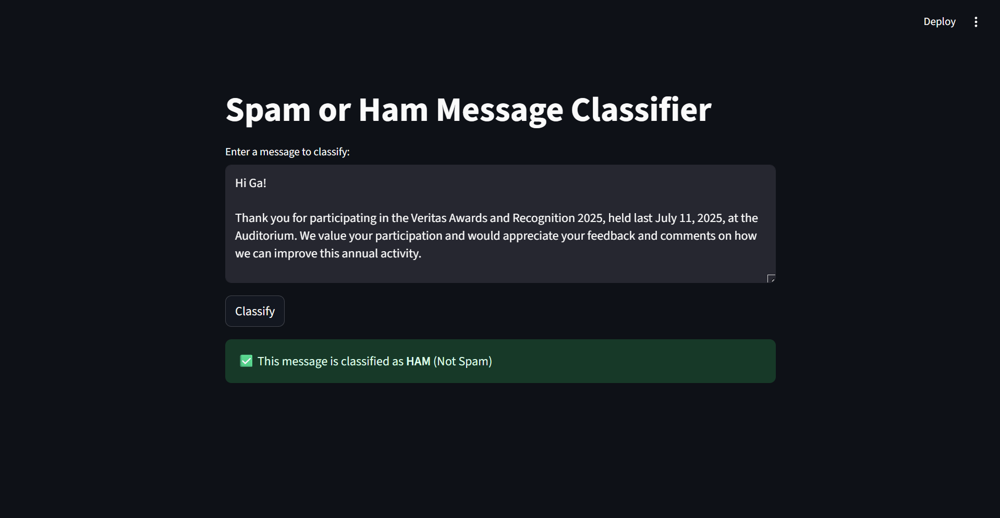
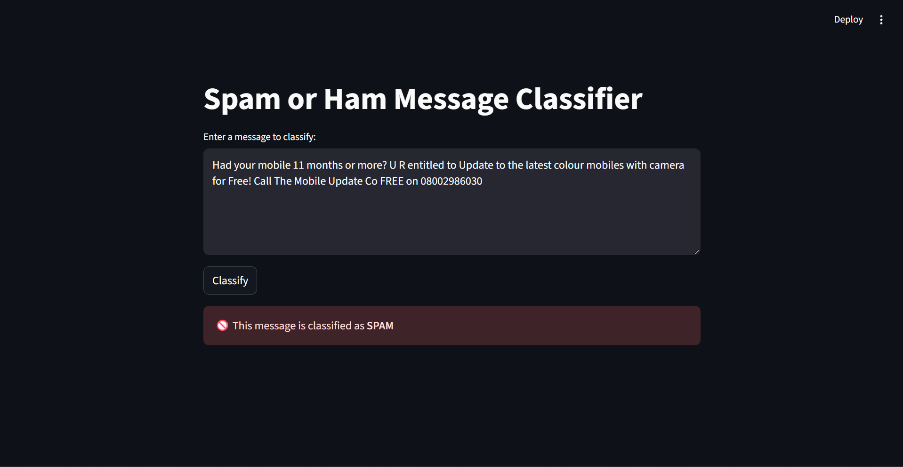

# SPAM CLASSIFICATION APP

## 📄 App Description

This Streamlit app is a simple Spam vs Ham (Not Spam) message classifier. It uses a Naive Bayes machine learning model trained on the popular SMS Spam Collection dataset from Kaggle. Users can input any message, and the app will predict whether it's spam or not in real-time.

## ⚙️ Setup Instructions

1. Clone or Download the App

    Make sure your working directory includes the spam.csv dataset file.

2. Install Required Libraries

    Run the following command in your terminal:

    pip install streamlit pandas scikit-learn

3. Run the App

In your terminal, navigate to the directory containing your script and run:

    streamlit run app.py

4. Interact

    A browser window will open.

    Enter a message into the text area.

    Click "Classify" to see whether the message is SPAM or HAM.

## Screenshots

### HAM: 

### SPAM:

